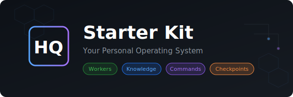

<p align="center">
  
</p>

<h1 align="center">HQ - Personal OS for AI Workers</h1>

<p align="center">
  <strong>Build your AI team. Ship projects autonomously. Never lose context.</strong>
</p>

<p align="center">
  <a href="https://opensource.org/licenses/MIT"></a>
  <a href="https://github.com/coreyepstein/hq-cli"></a>
</p>

<p align="center">
  <a href="#quick-start">Quick Start</a> •
  <a href="#whats-new">What's New</a> •
  <a href="#core-concepts">Core Concepts</a> •
  <a href="#commands">Commands</a> •
  <a href="#workers">Workers</a>
</p>

---

## What is HQ?

HQ is infrastructure for orchestrating **AI workers** — autonomous agents that code, write content, research, and automate tasks.

Not just files. Active systems that:
- **Execute** — Workers do real work autonomously
- **Learn** — Rules get injected into the files they govern
- **Scale** — Build workers for any domain with `/newworker`
- **Survive** — Threads persist across sessions, auto-handoff at context limits

```
┌─────────────────────────────────────────────────────────────────┐
│                           YOUR HQ                               │
├─────────────────────────────────────────────────────────────────┤
│                                                                 │
│   ┌─────────────┐    ┌─────────────┐    ┌─────────────┐        │
│   │   WORKERS   │    │  KNOWLEDGE  │    │  COMMANDS   │        │
│   │  Do things  │    │   Learn &   │    │ Orchestrate │        │
│   │ autonomously│    │   remember  │    │  workflows  │        │
│   └─────────────┘    └─────────────┘    └─────────────┘        │
│          │                  │                  │                │
│          └──────────────────┼──────────────────┘                │
│                             ▼                                   │
│                    ┌─────────────┐                              │
│                    │   THREADS   │                              │
│                    │   Survive   │                              │
│                    │   sessions  │                              │
│                    └─────────────┘                              │
│                                                                 │
└─────────────────────────────────────────────────────────────────┘
```

## Prerequisites

| Tool | Required | Install |
|------|----------|---------|
| [Claude Code](https://docs.anthropic.com/en/docs/claude-code) | Yes | `npm install -g @anthropic-ai/claude-code` |
| [GitHub CLI](https://cli.github.com/) | Yes | `brew install gh` then `gh auth login` |
| [qmd](https://github.com/tobi/qmd) | Recommended | `brew install tobi/tap/qmd` |
| [OpenAI Codex](https://openai.com/codex) | Optional | `npm install -g @openai/codex` then `codex login` |
| [Vercel CLI](https://vercel.com/docs/cli) | Optional | `npm install -g vercel` then `vercel login` |
| [ggshield](https://docs.gitguardian.com/ggshield-docs/getting-started/installation) | Recommended | `brew install ggshield` then `ggshield auth login` |

### LSP (Language Server Protocol)

Enable LSP tools for code intelligence (go-to-definition, find-references, type info) by setting:

```bash
echo 'export ENABLE_LSP_TOOL=1' >> ~/.zshrc && source ~/.zshrc
```

Then restart Claude Code. With LSP enabled, Claude prefers LSP over grep for code navigation — faster and more accurate for symbol lookups, type checking, and reference finding.

`/setup` checks for these automatically and guides you through anything missing.

### Secret Scanning (recommended)

Prevent API keys, tokens, and credentials from being committed:

```bash
brew install ggshield
ggshield auth login
ggshield install --mode global
```

This enables a pre-commit hook across all repos that blocks commits containing secrets. Free tier covers personal use.

## Quick Start

```bash
# 1. Clone
git clone https://github.com/coreyepstein/hq-starter-kit.git my-hq
cd my-hq

# 2. Open in Claude Code
claude

# 3. Run setup wizard (checks deps, creates profile, scaffolds knowledge repos)
/setup

# 4. Build your profile (optional but recommended)
/personal-interview
```

Setup asks your name, work, and goals. It also scaffolds your first knowledge repo as a symlinked git repo (see [Knowledge Repos](#knowledge-repos) below). The personal interview goes deeper — 18 questions to build your voice, preferences, and working style.

## What's New

### Hook Profiles + Secret Detection (v7.0)
Runtime-configurable hook system with three profiles — no `settings.json` edits needed:

```bash
# Minimal: safety hooks only (fastest)
HQ_HOOK_PROFILE=minimal claude

# Standard (default): all hooks active
HQ_HOOK_PROFILE=standard claude

# Disable specific hooks
HQ_DISABLED_HOOKS=auto-checkpoint-trigger claude
```

All hooks route through `hook-gate.sh`. New `detect-secrets` hook blocks API keys in bash commands. New `observe-patterns` hook captures session insights on stop.

### Audit Log (v7.0)
Track every task execution across projects and workers:

```bash
/audit                              # Summary: last 7 days
/audit --project my-app             # All events for a project
/audit --failures                   # Show only failures with error details
/audit --since 2026-03-01           # Custom date range
```

Populated automatically by `/run-project` and `/execute-task`. Stored as JSONL at `workspace/metrics/audit-log.jsonl`.

### 9 New Commands (v7.0)
| Command | Purpose |
|---------|---------|
| `/audit` | Query audit log events |
| `/brainstorm` | Explore approaches before committing to a PRD |
| `/dashboard` | Generate visual HTML goals dashboard |
| `/goals` | View and manage OKR structure |
| `/harness-audit` | Score HQ setup quality across 7 categories |
| `/idea` | Capture a project idea without a full PRD |
| `/model-route` | Recommend optimal Claude model for a task |
| `/quality-gate` | Universal pre-commit checks (typecheck, lint, test) |
| `/tdd` | RED→GREEN→REFACTOR cycle with coverage validation |

### 4 New Workers (v7.0)
| Worker | Type | Purpose |
|--------|------|---------|
| **accessibility-auditor** | OpsWorker | WCAG 2.2 AA auditing with remediation plans |
| **exec-summary** | OpsWorker | McKinsey SCQA executive summaries |
| **performance-benchmarker** | OpsWorker | Core Web Vitals + k6 load testing |
| **reality-checker** | CodeWorker | Final quality gate — verifies impl matches spec |

### Full Ralph Orchestrator (v7.0)
`run-project.sh` now includes audit log integration, `--tmux` mode for parallel execution, session ID tracking, and checkout guards in `/execute-task`.

### Codex Workers + MCP Integration (v5.3)
Three production workers powered by OpenAI Codex SDK via MCP. Workers connect via **Model Context Protocol** — a shared `codex-engine` MCP server wraps the Codex SDK.

### Context Diet (v5.1)
Sessions lazy-load only what the task needs. No pre-loading INDEX.md or agents.md.

### Learning System (v5.0)
Rules get injected directly into the files they govern via `/learn` and `/remember`.

---

## Core Concepts

### Workers
Autonomous agents with defined skills. They *do things*.

| Type | Purpose | Examples |
|------|---------|----------|
| **CodeWorker** | Implement features, fix bugs | codex-coder, backend-dev |
| **ContentWorker** | Draft content, maintain voice | brand-writer, copywriter |
| **SocialWorker** | Post to platforms | x-worker, linkedin-poster |
| **ResearchWorker** | Analyze data, markets | analyst, researcher |
| **OpsWorker** | Reports, automation | cfo-worker, monitor |

### Knowledge Bases
Workers learn from and contribute to shared knowledge:

- `knowledge/Ralph/` — Autonomous coding methodology
- `knowledge/workers/` — Worker patterns & templates
- `knowledge/ai-security-framework/` — Security best practices
- `knowledge/dev-team/` — Development patterns
- `knowledge/design-styles/` — Design guidelines

### Commands
Slash commands orchestrate everything:

```bash
/run worker-name skill    # Execute a worker skill
/checkpoint my-work       # Save session state
/handoff                  # Prepare for fresh session
```

### Threads
Work survives context limits:

```bash
/checkpoint feature-x     # Save state
# ... context fills up → auto-handoff triggers ...
/nexttask                 # Finds thread, continues work
```

---

## Commands

### Session
| Command | What it does |
|---------|--------------|
| `/checkpoint` | Save progress to thread |
| `/handoff` | Prepare handoff for fresh session |
| `/reanchor` | Pause, show state, realign |
| `/nexttask` | Find next thing to work on |

### Learning
| Command | What it does |
|---------|--------------|
| `/learn` | Auto-capture learnings from task execution |
| `/remember` | Manual correction → injects rule into source file |

### Workers
| Command | What it does |
|---------|--------------|
| `/run` | List all workers |
| `/run {worker} {skill}` | Execute a skill |
| `/newworker` | Create a new worker |
| `/metrics` | View worker execution metrics |

### Projects
| Command | What it does |
|---------|--------------|
| `/prd` | Generate PRD through discovery |
| `/run-project` | Execute project via Ralph loop |
| `/execute-task` | Run single task with workers |

### Quality & Analysis
| Command | What it does |
|---------|--------------|
| `/audit` | Query and display audit log events |
| `/harness-audit` | Score HQ setup quality (7 categories) |
| `/quality-gate` | Pre-commit checks (typecheck, lint, test) |
| `/tdd` | RED→GREEN→REFACTOR with coverage validation |
| `/model-route` | Recommend optimal Claude model for a task |
| `/dashboard` | Generate visual HTML goals dashboard |

### Planning
| Command | What it does |
|---------|--------------|
| `/brainstorm` | Explore approaches before committing to a PRD |
| `/idea` | Capture a project idea without a full PRD |
| `/goals` | View and manage OKR structure |

### System
| Command | What it does |
|---------|--------------|
| `/search` | Semantic + full-text search across HQ |
| `/search-reindex` | Rebuild search index |
| `/cleanup` | Audit and clean HQ |
| `/setup` | Interactive setup wizard |
| `/personal-interview` | Deep interview to build profile + voice |
| `/exit-plan` | Force exit from plan mode |

---

## Workers

### Bundled: Codex Workers

Three production workers that use OpenAI Codex SDK via MCP:

| Worker | Skills | Purpose |
|--------|--------|---------|
| **codex-coder** | generate-code, implement-feature, scaffold-component | Code generation in Codex sandbox |
| **codex-reviewer** | review-code, improve-code, apply-best-practices | Second-opinion review + automated improvements |
| **codex-debugger** | debug-issue, root-cause-analysis, fix-bug | Auto-escalation on back-pressure failure |

```bash
# Generate code
/run codex-coder generate-code --task "Create a rate limiter middleware"

# Review for security issues
/run codex-reviewer review-code --files src/auth/*.ts --focus security

# Debug a failing test
/run codex-debugger debug-issue --issue "TS2345 type error" --error-output "$(cat errors.txt)"
```

These workers share a **codex-engine** MCP server. To use them, you'll need a Codex API key (`CODEX_API_KEY` env var). See `workers/dev-team/codex-coder/worker.yaml` for the full pattern.

### Build Your Own

Start from the included sample worker:

```bash
# Option 1: Interactive scaffold
/newworker

# Option 2: Manual
cp -r workers/sample-worker workers/my-worker
# Edit workers/my-worker/worker.yaml
```

Worker YAML structure (with modern patterns):

```yaml
worker:
  id: my-worker
  name: "My Worker"
  type: CodeWorker
  version: "1.0"

execution:
  mode: on-demand
  max_runtime: 15m
  retry_attempts: 1
  spawn_method: task_tool

skills:
  - id: do-thing
    file: skills/do-thing.md

verification:
  post_execute:
    - check: typescript
      command: npm run typecheck
    - check: test
      command: npm test
  approval_required: true

# MCP Integration (optional)
# mcp:
#   server:
#     command: node
#     args: [path/to/mcp-server.js]
#   tools:
#     - tool_name

state_machine:
  enabled: true
  max_retries: 1
  hooks:
    post_execute: [auto_checkpoint, log_metrics]
    on_error: [log_error, checkpoint_error_state]
```

### Worker Types

| Type | Purpose |
|------|---------|
| **CodeWorker** | Features, bugs, refactors |
| **ContentWorker** | Writing, voice, messaging |
| **SocialWorker** | Platform posting |
| **ResearchWorker** | Analysis, data, markets |
| **OpsWorker** | Reports, automation, ops |
| **Library** | Shared utilities (no skills) |

See `knowledge/workers/` for the full framework, templates, and patterns.

---

## Project Execution

HQ uses the **Ralph Methodology** for autonomous coding.

### The Loop

```
1. Orchestrator picks next story from PRD (passes: false)
2. Spawn fresh Claude session with story assignment
3. Run back pressure (tests, lint, typecheck)
4. If passing → commit, mark passes: true
5. Retry failures (up to 2 attempts), then skip
6. Repeat until all stories complete
```

### Why It Works

- **Fresh context per story** — No accumulated confusion
- **Back pressure validates** — Code that doesn't pass isn't done
- **Atomic commits** — One story = one commit
- **PRD is truth** — Simple JSON, easy to inspect
- **State machine** — Survives interruptions, resumes where it left off
- **File locks** — Prevents concurrent edit conflicts across stories

### Running a Project

```bash
# 1. Create PRD
/prd "Build user authentication"

# 2. Execute via Ralph loop (uses .claude/scripts/run-project.sh)
/run-project auth-system

# 3. Monitor progress
/run-project auth-system --status

# 4. Resume after interruption
/run-project auth-system --resume

# 5. Retry failed stories
/run-project auth-system --retry-failed
```

The orchestrator script (`.claude/scripts/run-project.sh`) can also be run directly:

```bash
.claude/scripts/run-project.sh my-project --dry-run     # Preview without executing
.claude/scripts/run-project.sh my-project --verbose      # Detailed output
.claude/scripts/run-project.sh my-project --max-budget 5 # Cap at $5
```

---

## Knowledge Repos

Knowledge bases in HQ are **independent git repos**, symlinked into the `knowledge/` directory. This lets you version, share, and publish each knowledge base separately from HQ itself.

### How it works

```
repos/private/knowledge-personal/    ← actual git repo
    └── README.md, notes.md, ...

knowledge/personal → ../../repos/private/knowledge-personal   ← symlink
```

HQ git tracks the symlink. The repo contents are tracked by their own git. Tools (`qmd`, `Glob`, `Read`) follow symlinks transparently.

### Creating a knowledge repo

```bash
# 1. Create and init the repo
mkdir -p repos/public/knowledge-my-topic
cd repos/public/knowledge-my-topic
git init
echo "# My Topic" > README.md
git add . && git commit -m "init knowledge repo"
cd -

# 2. Symlink into HQ
ln -s ../../repos/public/knowledge-my-topic knowledge/my-topic
```

For company-scoped knowledge:
```bash
ln -s ../../../repos/private/knowledge-acme companies/acme/knowledge/acme
```

### Committing knowledge changes

Changes appear in `git status` of the *target repo*, not HQ:
```bash
cd repos/public/knowledge-my-topic
git add . && git commit -m "update notes" && git push
```

### Bundled knowledge

The starter kit ships Ralph, workers, security framework, etc. as plain directories. These work as-is. To convert one to a versioned repo later:

```bash
mv knowledge/Ralph repos/public/knowledge-ralph
cd repos/public/knowledge-ralph && git init && git add . && git commit -m "init"
cd -
ln -s ../../repos/public/knowledge-ralph knowledge/Ralph
```

---

## Directory Structure

```
my-hq/
├── .claude/
│   ├── CLAUDE.md              # Session protocol + Context Diet
│   ├── commands/              # 35+ slash commands
│   ├── hooks/                 # hook-gate, detect-secrets, observe-patterns
│   └── scripts/
│       └── run-project.sh     # Ralph loop orchestrator
├── agents.md                  # Your profile
├── knowledge/                 # Symlinks → repos/ (or plain dirs)
│   ├── Ralph/                 # Coding methodology
│   ├── workers/               # Worker framework + templates
│   ├── ai-security-framework/ # Security practices
│   ├── dev-team/              # Development patterns
│   ├── design-styles/         # Design guidelines
│   ├── hq-core/               # Thread schema, INDEX spec
│   ├── loom/                  # Agent patterns
│   └── projects/              # Project guidelines
├── repos/
│   ├── public/                # Public repos + knowledge repos
│   └── private/               # Private repos + knowledge repos
├── scripts/
│   └── audit-log.sh           # Audit log append/query/summary
├── workers/
│   ├── registry.yaml          # Worker index
│   ├── sample-worker/         # Example (copy + customize)
│   ├── accessibility-auditor/ # WCAG 2.2 AA auditing
│   ├── exec-summary/          # Executive summaries
│   ├── performance-benchmarker/ # Core Web Vitals + load testing
│   └── dev-team/              # Codex workers, reality-checker, + more
├── prompts/
│   └── pure-ralph-base.md     # Ralph loop prompt template
├── projects/                  # Your PRDs
├── workspace/
│   ├── threads/               # Auto-saved sessions
│   │   └── recent.md          # Recent thread index
│   ├── orchestrator/          # Project state
│   └── learnings/             # Captured insights
└── companies/                 # Multi-company setup (optional)
```

---

## Part of the HQ Framework

| Component | Purpose |
|-----------|---------|
| **hq-starter-kit** | This repo — personal OS template |
| **[hq-cli](https://github.com/coreyepstein/hq-cli)** | Module management CLI |

---

## Customization

This is a **template**. Make it yours:

- Build workers for your workflows (`/newworker`)
- Create knowledge bases for your domains
- Add commands for your patterns
- Connect tools via MCP
- Run `/personal-interview` to teach it your voice

---

## Credits

- **Ralph Methodology** by [Geoffrey Huntley](https://ghuntley.com/ralph/)
- **Loom Agent Architecture** by [Geoffrey Huntley](https://github.com/ghuntley/loom) — Thread system, state machine, and agent patterns
- Inspired by personal knowledge systems and AI workflow patterns

## License

MIT — Do whatever you want with it.
