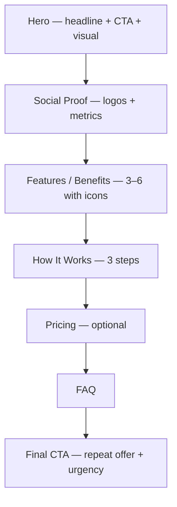

# Landing Page

Conversion-focused single page that moves a visitor from awareness to action.

## Anatomy

## Sections

### 1. Hero
- **Purpose:** Communicate the offer in under 5 seconds. Capture attention, establish credibility, drive the first CTA click.
- **Pattern:** Full-viewport or near-full-viewport. Headline left-aligned or centered. CTA button prominent below headline. Visual (screenshot, illustration, 3D render) right-aligned on desktop, stacked below on mobile.
- **Content:** One sharp headline (what you do + for whom), one-line subhead (how or why), primary CTA button, optional secondary link ("See demo", "Learn more"), product screenshot or hero image.
- **Common mistakes:** Two competing CTAs at equal visual weight. Hero headline that describes features instead of outcomes. Visual that distracts from reading the headline. Hero so tall the user never scrolls.

### 2. Social Proof — Logos & Metrics
- **Purpose:** Immediately answer "who else uses this?" and "is it real?" Trust transfer happens here.
- **Pattern:** Horizontal row of customer logos (grayscale). Optional metric strip below: 3–4 bold stats ("10,000 teams", "99.9% uptime", "4.9 stars").
- **Content:** 5–8 recognizable customer logos, optionally a brief testimonial pull quote above or below.
- **Common mistakes:** Fake or low-res logos. Metrics that aren't specific ("thousands of users"). Placing this section too far down the page — it should appear within one scroll of the hero.

### 3. Features / Benefits
- **Purpose:** Answer "what does it actually do?" — show capability while framing in user outcomes.
- **Pattern:** 3-column or 2-column icon grid. Each card: icon, short title (3–5 words), 1–2 sentence description. Alternatively, alternating left/right image + text rows for a richer treatment.
- **Content:** 3–6 features. Lead with the most differentiating, not the most obvious. Title from user perspective ("Ship in hours" not "Fast deployment").
- **Common mistakes:** More than 6 features — signals lack of focus. Feature names, not benefits. All features equal weight — let the best one breathe more.

### 4. How It Works
- **Purpose:** Reduce friction by making the path to value concrete and short.
- **Pattern:** Numbered 3-step horizontal row (desktop) or vertical stack (mobile). Each step: number, title, 1-sentence description. Optional: animated or static screenshot showing each step.
- **Content:** 3 steps max. Start from zero ("Create your account") or from the user's existing pain ("Connect your existing tools"). End at the moment of value, not just task completion.
- **Common mistakes:** More than 3–4 steps — implies complexity. Steps that describe UI actions instead of outcomes. Missing visual — text-only steps feel abstract.

### 5. Pricing
- **Purpose:** Remove the "how much?" objection before it derails a sales conversation.
- **Pattern:** 2–4 pricing tiers in cards. Center or highlight the recommended tier visually. Feature comparison table below if tiers differ significantly. Monthly/annual toggle.
- **Content:** Tier name, price, 4–6 bullet features, CTA per tier. "Most popular" badge on middle tier. Link to full comparison or enterprise contact.
- **Common mistakes:** Burying price — if you have public pricing, show it early. Too many tiers. Vague feature names in the comparison table. No clear recommended tier.

### 6. FAQ
- **Purpose:** Handle objections passively. Pre-answer the questions that stall signups.
- **Pattern:** Accordion or simple Q+A pairs. 5–8 questions max. Can be 2-column on desktop.
- **Content:** Address real objections: pricing, cancellation, data security, integrations, support. Write the question as a skeptic would actually phrase it — not a marketing spin.
- **Common mistakes:** FAQ that reads like a brochure (questions nobody asks). Accordion that hides content from crawlers if SEO matters. More than 8 items — becomes a wall to ignore.

### 7. Final CTA
- **Purpose:** Convert the visitors who read everything but didn't click at the top.
- **Pattern:** Full-width section, high contrast (dark or brand color). Single headline restating the core offer. One CTA button. Optional: brief supporting line ("No credit card required", "Free 14-day trial").
- **Content:** Restate the benefit, not just the action. "Start building in minutes" not just "Sign up".
- **Common mistakes:** Repeating the hero headline word-for-word — reinforce, don't duplicate. Cluttered final CTA with multiple links. Missing urgency or incentive for someone still on the fence.

## Style Pairings

| Style | Fit | Notes |
|-------|-----|-------|
| Minimalist Swiss | Strong | Safe default for SaaS, dev tools, productivity apps. Grid + whitespace lets the offer breathe. |
| Corporate Clean | Strong | B2B and enterprise. Projects trust. Pairs well with benefit-led copy. |
| Dark Luxury | Strong | Premium or high-ticket products. Dark hero + editorial type signals exclusivity. |
| American Industrial | Moderate | AI/ML, infrastructure, technical products. Bold and precise. Avoid for consumer apps. |
| Editorial Magazine | Moderate | Creative products, agencies, media tools. Expressive but requires strong copy. |
| Brutalist Raw | Moderate | Dev tools, open source, counter-cultural products. Standout risk — high upside or alienating. |
| Retro Analog | Weak | Rarely appropriate for SaaS landing pages — warmth can undercut product credibility. |
| Ethereal Abstract | Weak | Atmospheric imagery works as a supplement, not a layout system. Use selectively in hero. |
| Liminal Portal | Weak | Too contemplative for conversion-first pages. Reserve for brand storytelling contexts. |

## Typography Recipe

| Element | Spec |
|---------|------|
| Hero headline | 56–80px, bold (700–800), tight tracking (−0.02em to −0.04em), 1.1–1.2 line-height |
| Hero subhead | 18–22px, regular (400), relaxed tracking, 1.5 line-height, secondary text color |
| Section headline | 36–48px, semibold (600–700), −0.01em tracking |
| Feature title | 18–20px, semibold (600) |
| Body / description | 16–18px, regular (400), 1.6–1.7 line-height, 60–70ch max-width |
| CTA button text | 15–17px, semibold (600), sentence case |
| Label / eyebrow | 12–13px, medium (500), all-caps or tracked-out, brand color or muted gray |
| Price | 40–56px, bold (700), tabular figures |
| FAQ question | 17–18px, semibold (600) |

Font suggestions: Inter, Geist, Neue Haas Grotesk, Plus Jakarta Sans, DM Sans

## Color Strategy

- **Primary action:** Brand color on CTA buttons — use nowhere else at the same saturation to preserve click magnetism
- **Background:** Off-white (`#FAFAFA`–`#F5F5F5`) for light mode; pure white for content cards creates subtle lift. Alternate section backgrounds with a slightly warmer or cooler gray (`#F0F0EE`) to create rhythm without hard borders.
- **Hierarchy signals:** Hero headline in near-black (`#111`). Subhead and body in mid-gray (`#444`–`#666`). Labels and metadata in light gray (`#888`–`#AAA`). Color should only appear on CTAs and key accent elements — not scattered decoration.
- **Social proof logos:** Desaturate to 0% and reduce opacity to 60–70% for a cohesive, non-cluttered strip.
- **Pricing highlight:** Use brand color background or a bold border on the recommended tier card.

## Spacing & Rhythm

- Section padding: `6rem`–`10rem` top/bottom (`96px`–`160px`) on desktop; `4rem`–`6rem` on mobile
- Content max-width: `1100px`–`1280px` for full-width sections; `720px`–`800px` for text-heavy content columns
- Hero headline max-width: `700px`–`900px` (prevent over-wide line lengths)
- Vertical rhythm: 8px base unit — all spacing in multiples of 8 (8, 16, 24, 32, 48, 64, 96, 128)
- Card gap: `24px`–`32px`
- CTA button padding: `14px`–`18px` vertical, `28px`–`36px` horizontal — generous, never cramped

## OSS Stack

| Need | Recommended | Alt |
|------|-------------|-----|
| Framework | Next.js (App Router) | Astro (static), Remix |
| Styling | Tailwind CSS | CSS Modules, Vanilla Extract |
| Components | shadcn/ui | Radix UI primitives |
| Animation | Framer Motion | GSAP, Motion One |
| Icons | Lucide | Heroicons, Phosphor |
| Fonts | next/font (Google Fonts) | Fontsource |
| Analytics | Plausible | PostHog, Umami |
| Forms | React Hook Form + Zod | Formspree (no-code) |

## Responsive Breakpoints

| Breakpoint | Layout change |
|------------|--------------|
| < 640px | Single column throughout. Hero visual stacks below text. Feature grid 1-col. Pricing cards stack vertically. Nav collapses to hamburger. |
| 640–1024px | 2-column feature grid. Hero stays single column with centered text. Pricing may 2-col if 2 tiers. |
| > 1024px | Full desktop layout: hero with side-by-side text + visual. 3-col feature grid. Horizontal How It Works. 3-col pricing. |

## Checklist

- [ ] Hero headline communicates the outcome, not the feature
- [ ] Single primary CTA in the hero — no competing links at equal visual weight
- [ ] Social proof appears within one scroll of the hero
- [ ] Customer logos are real, high-res, and desaturated
- [ ] Features are framed as benefits (user outcome language)
- [ ] How It Works has 3 steps or fewer
- [ ] If pricing is public, it's on the page
- [ ] FAQ answers real objections, not planted softballs
- [ ] Final CTA section is high contrast and repeats the core offer
- [ ] Page loads in < 2.5s (LCP) — optimize hero image
- [ ] Mobile layout tested at 375px width
- [ ] CTA buttons pass WCAG AA contrast ratio
- [ ] Open Graph image set for social sharing
- [ ] No orphaned words (single words on last line of a headline)

## Examples

- [linear.app](https://linear.app) — Swiss precision applied to SaaS. Observe the headline economy, feature section pacing, and logo strip treatment.
- [vercel.com](https://vercel.com) — Dark hero with near-monochrome palette. Study the feature section's animation + text balance.
- [stripe.com](https://stripe.com) — Elevated copywriting paired with bold product screenshots. Notice how each section has a distinct visual rhythm.
- [notion.so](https://notion.so) — Benefit-led headline above a product screenshot. Feature section uses alternating image/text rows effectively.
- [arc.net](https://arc.net) — Bold, personality-forward landing page. Study the final CTA section for contrast and urgency.
- [raycast.com](https://raycast.com) — Dark luxury treatment for a developer tool. Observe the keyboard shortcut UI as hero visual and the feature grid depth.
