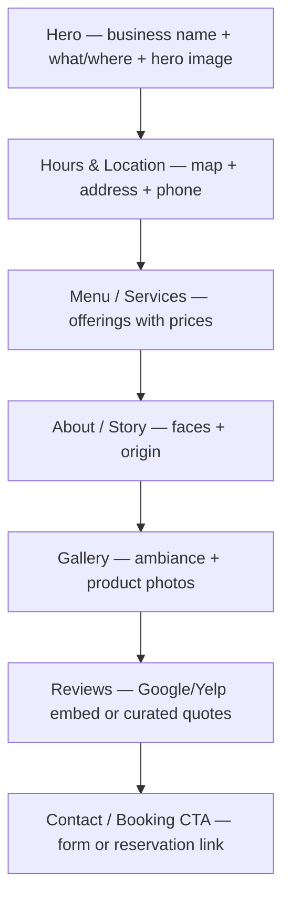

# Local Business

Restaurant, shop, salon, or service provider site — fast-loading, mobile-first, surfacing essential information immediately.

## Anatomy

## Sections

### 1. Hero
- **Purpose:** Answer the four questions every local visitor has in the first 3 seconds: What is this place? What do they sell or do? Where is it? Is it worth my time?
- **Pattern:** Full or near-full viewport on desktop. On mobile (priority): business name visible above the fold, hero image below or behind, one key action button (Order Online, Book Now, Get Directions). High-quality hero image of the space, product, or food — not a stock photo.
- **Content:** Business name (large and legible), brief descriptor or tagline, neighborhood or address, primary CTA button (varies by business type: "Reserve a Table", "Book Appointment", "Order Now", "Get Directions"), hero image or video.
- **Common mistakes:** Hero image that doesn't show what the business actually looks like or sells. CTA that goes to a dead form. Hero that looks great on desktop but buries the business name behind a dark image on mobile. Stock photography — the trust cost of generic imagery is higher than having no image at all.

### 2. Hours & Location
- **Purpose:** The most visited section for any local business site. If someone has to hunt for your hours or address, they're gone.
- **Pattern:** This section should appear within one scroll from the hero on desktop, and be reachable via a visible "Hours" anchor link in the nav on mobile. Hours in a simple table or list (Mon–Sun with times, closed days clearly labeled). Address linked to Google Maps. Phone number as a `tel:` link (one tap to call on mobile). Embedded Google Map iframe below.
- **Content:** Business hours by day, address with map embed or link, phone number, email (secondary), parking notes if relevant, transit access if urban.
- **Common mistakes:** Hours not updated for holidays or seasonal changes. Address with no map link — people expect one-tap to navigation. Hours in image format — screen readers and crawlers can't read it. Phone number not a `tel:` link — forces mobile users to manually dial.

### 3. Menu / Services
- **Purpose:** Let visitors decide before they arrive. Reduce the friction of "I don't know what they have."
- **Pattern:** For restaurants: categorized menu sections (Appetizers, Mains, Drinks, Desserts) with item names, brief descriptions, and prices. Avoid PDF menus — they're unindexable and mobile-hostile. For service businesses: service name, brief description, duration, price or price range. 2-column desktop, 1-column mobile.
- **Content:** Item/service name, 1–2 sentence description, price, optional dietary or category tags. For restaurants: seasonal note if menu changes. For services: what's included, typical duration, any prerequisites.
- **Common mistakes:** PDF menu that isn't mobile-friendly and can't be crawled by Google. No prices — users who can't see prices before visiting are more likely to choose a competitor who shows them. Menu sections without visual separation — one long undifferentiated list is exhausting. Outdated prices — erodes trust when the check arrives.

### 4. About / Story
- **Purpose:** Build the human connection that makes someone choose a local business over a chain or competitor. People patronize places they feel connected to.
- **Pattern:** 2–3 paragraphs of founder or team story. Photo of the owner, team, or a behind-the-scenes moment. This section should feel personal, not corporate. Optional: "Meet the team" with small photos and one-liners per person.
- **Content:** Origin story (brief — why this business exists), what makes the approach distinctive, community connection if relevant, team photo or portrait.
- **Common mistakes:** Generic mission statement ("We are committed to serving the community with the finest..."). Corporate photography — stiff posed headshots undercut the warmth the section is supposed to create. Too long — 3 paragraphs maximum. Missing a face — anonymity in a local business context reads as cold.

### 5. Gallery
- **Purpose:** Atmosphere, product quality, and ambiance — let the photos sell the visit.
- **Pattern:** Grid or masonry layout. 6–12 images minimum. Mix of: interior/exterior shots, close-up product shots, people enjoying the experience (with permission), behind-the-scenes. Lightbox on click for full-size view.
- **Content:** Real photography, not stock. Best images lead. If the business has seasonal changes (seasonal menu, holiday decor), update the gallery to match.
- **Common mistakes:** Low-resolution images — the photos represent the quality of the product. Too few photos — a 3-photo gallery signals an incomplete or abandoned site. No variety — all food photos or all exterior shots tells an incomplete story. Images that aren't optimized for web — gallery pages that take 10 seconds to load on mobile are abandoned.

### 6. Reviews
- **Purpose:** Third-party validation from real customers in the visitor's own community.
- **Pattern:** 3–5 curated review quotes displayed on the site (pull the most specific, most compelling). Star rating displayed prominently (average from Google/Yelp). Link to full Google/Yelp listing for social proof. Optional: Google Reviews embed widget.
- **Content:** Full quotes (not just star ratings), reviewer name and optionally their neighborhood/context, platform source (Google, Yelp), overall star rating.
- **Common mistakes:** Fabricated or unattributed reviews — the risk to trust outweighs the perceived benefit. Generic reviews only ("Great place! 5 stars!") — seek out the specific, story-driven reviews. No link to the live review platform — visitors want to see the full picture. Outdated reviews from 5+ years ago.

### 7. Contact / Booking CTA
- **Purpose:** Convert interest into action — reservation, appointment, or inquiry.
- **Pattern:** For restaurants: embedded reservation widget (OpenTable, Resy, Yelp Reservations) or phone/email prompt. For salons/services: embedded booking widget (Booksy, Square Appointments, Calendly) or link to booking system. For shops: address + hours + optional contact form for custom inquiries. Final section should also restate hours if relevant.
- **Content:** Primary action (book/reserve/order), secondary contact method (phone or email), hours reiterated briefly, social media follow prompts.
- **Common mistakes:** Contact form as the only booking method — too high friction for a restaurant reservation. Booking widget that doesn't work on mobile. No phone number — many local customers (especially older demographics) prefer to call. Reservations that go nowhere — broken integrations happen, check them regularly.

## Style Pairings

| Style | Fit | Notes |
|-------|-----|-------|
| Retro Analog | Strong | Warm, tactile, inviting. Perfect for cafes, bars, bakeries, artisan food, vintage shops. The warmth matches what local businesses need to communicate. |
| Corporate Clean | Strong | Professional services: accountants, law offices, medical practices, financial advisors. Signals competence and reliability. |
| Minimalist Swiss | Strong | Upscale establishments: fine dining, high-end salons, boutique retail. Sparse design signals premium positioning. |
| Editorial Magazine | Moderate | Works for personality-forward restaurants, concept stores, or businesses with a strong editorial identity. Requires good photography. |
| Dark Luxury | Moderate | Premium bars, cocktail lounges, high-end spas. Rich and atmospheric — requires exceptional photography to deliver. |
| Brutalist Raw | Weak | Too confrontational for most local business contexts. Might work for a streetwear shop or experimental bar, but alienates most local audiences. |
| American Industrial | Weak | Can work for auto shops or craft breweries, but usually too cold for service businesses that depend on community warmth. |
| Ethereal Abstract | Weak | Too abstract — local business visitors need concrete information, not atmospheric imagery as a layout system. |

## Typography Recipe

| Element | Spec |
|---------|------|
| Business name / hero | 48–80px, bold (700–900), tight tracking; handwritten or script fonts work if legible at size |
| Tagline | 18–24px, regular or italic (400), warm secondary color or contrasting weight |
| Section headline | 28–40px, bold (700), aligned to brand character |
| Hours day labels | 14–16px, medium (500) |
| Hours times | 14–16px, regular (400), tabular figures |
| Menu category | 20–26px, bold (700) or small-caps, separator style |
| Menu item name | 16–18px, semibold (600) |
| Menu description | 14–15px, regular (400), muted color, 50ch max-width |
| Menu price | 14–16px, regular (400), right-aligned or inline |
| Body / about text | 16–18px, regular (400), 1.65–1.75 line-height, 60–65ch max |
| Review quote | 17–20px, italic (400) |

Font suggestions by style — Retro Analog: DM Serif Display + DM Sans, or Playfair Display + Source Sans. Corporate Clean: Inter + Inter. Minimalist Swiss: Neue Haas Grotesk or Inter throughout. For restaurants with personality: consider custom or distinctive display typefaces for the name only, paired with a clean body font.

## Color Strategy

- **Primary action:** Booking/reservation button uses the brand accent — make it immediately visible on mobile without scrolling
- **Background:** Warm whites (`#FFFDF9`, `#FAF8F4`) or cream backgrounds for Retro Analog and warm-feeling businesses. True white for Corporate Clean and Minimalist treatments. Avoid pure `#FFFFFF` for warmth-dependent businesses — it reads clinical.
- **Hierarchy signals:** Business name at maximum contrast. Menu items and section headers at strong contrast. Descriptions and metadata in a warm mid-gray. Prices in the same color as item names — never use color to separate price from item, it creates visual noise.
- **Photography integration:** Let the hero image's dominant color inform the palette if no strong brand color exists. A restaurant with warm amber wood tones can carry those warm neutrals into the type and background colors.
- **CTA buttons:** For mobile, the booking/order CTA should be large enough to tap comfortably — 48px minimum height, full-width or near-full-width on small screens.

## Spacing & Rhythm

- Section padding: `4rem`–`7rem` top/bottom desktop; `3rem`–`4rem` mobile — local business sites are information-dense, don't over-space
- Content max-width: `960px`–`1100px` — tighter than SaaS sites, feels more intimate
- Menu item row padding: `12px`–`16px` vertical per item — comfortable scanning rhythm
- Gallery gap: `8px`–`16px` — tight grid makes the gallery feel rich
- Map embed height: `300px`–`400px` desktop; `220px`–`280px` mobile
- CTA button minimum height: `48px` on mobile (touch target requirement)
- Vertical rhythm: 8px base unit

## OSS Stack

| Need | Recommended | Alt |
|------|-------------|-----|
| Framework | Next.js | Astro (static), Squarespace/Webflow (no-code) |
| Styling | Tailwind CSS | CSS Modules |
| Components | shadcn/ui | Headless UI |
| Animation | Framer Motion (light use) | CSS transitions only |
| Icons | Lucide | Heroicons |
| Gallery lightbox | yet-another-react-lightbox | Fancybox |
| Map embed | Google Maps iframe | Mapbox GL JS |
| Booking | OpenTable widget, Booksy, Resy | Square Appointments, Calendly |
| Reviews | Elfsight (Google Reviews widget) | Manual curated quotes |
| Fonts | next/font | Fontsource |

## Responsive Breakpoints

| Breakpoint | Layout change |
|------------|--------------|
| < 640px | Mobile-first priority: business name, hours, phone, and booking CTA visible in first screen. Single column throughout. Menu as expandable category sections. Map full-width. Booking CTA pinned to bottom or highly prominent. |
| 640–1024px | 2-column menu layout. Hours and map side-by-side. Gallery 2–3 columns. About text + photo side-by-side. |
| > 1024px | 3-column gallery. Menu in 2–3 columns. Full embedded map. About section with generous image treatment. |

## Checklist

- [ ] Business name visible above the fold on mobile (375px)
- [ ] Phone number is a `tel:` link (one-tap call on mobile)
- [ ] Address links to Google Maps (one-tap navigation on mobile)
- [ ] Hours visible within first scroll — not buried
- [ ] Hours are current and include holiday/seasonal notes
- [ ] Menu has real prices (not "market price" for everything)
- [ ] Menu is HTML, not a PDF
- [ ] Gallery has real photography, not stock images
- [ ] Gallery images are optimized (WebP, lazy-loaded)
- [ ] Booking/reservation CTA works and has been tested end-to-end
- [ ] At least 3 real customer reviews with names
- [ ] Page loads in < 2s on mobile (4G connection) — local search penalizes slow sites
- [ ] Google Business Profile is claimed and links to this site
- [ ] Schema markup added (LocalBusiness, Restaurant, or relevant type)
- [ ] Open Graph image set (ideally the best food/product/exterior photo)
- [ ] Site tested on iOS Safari and Android Chrome at 375px

## Examples

- [sweetgreen.com](https://sweetgreen.com) — Fast casual chain but sets a strong baseline for local-feeling design at scale. Observe the mobile layout, menu structure, and location finder.
- Local restaurants on Squarespace showcase — search Squarespace's template showcases for "restaurant" to see how the formula is executed across different style personalities.
- [levainbakery.com](https://levainbakery.com) — Warm, community-oriented bakery site. Study the story section and gallery photography style.
- [tattersalldc.com](https://tattersalldc.com) — Independent restaurant with well-structured menu, gallery, and reservation flow.
- Any highly-rated local restaurant on Yelp that has built their own site — open DevTools and check: mobile layout, menu format, and how fast it loads on a simulated slow connection.
