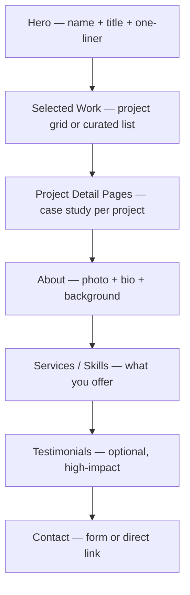

# Portfolio

Personal or agency portfolio site that showcases work, communicates personality, and drives inquiries.

## Anatomy

## Sections

### 1. Hero
- **Purpose:** Communicate who you are, what you do, and for whom — before the visitor has scrolled.
- **Pattern:** Usually not full-viewport. Name large (or the studio name). Title or specialty in a smaller, secondary style. One-line positioning statement. Optional: current status ("Available for freelance", "Open to full-time"). Optional: hero image (portrait, or abstract visual representing the work).
- **Content:** Name or studio name, professional title (specific beats vague — "Brand designer for early-stage startups" not "Creative professional"), one-sentence positioning or tagline, CTA ("View work" or direct scroll), optional current availability.
- **Common mistakes:** Hero that says nothing memorable ("Hi, I'm Alex, a passionate designer"). Generic title like "Creative Director" with no context. Hero image that competes with the text for attention. No CTA — visitors don't know where to go first.

### 2. Selected Work
- **Purpose:** Show the range and quality of work at a glance. Let the work do the talking.
- **Pattern:** Grid (2–3 columns desktop, 1–2 mobile) or curated list (full-width rows, more editorial). Each card: project image/thumbnail, client or project name, brief descriptor (2–5 words). Cards link to case study pages. Show 4–8 projects — quantity signals volume but dilutes quality.
- **Content:** 4–8 best projects. Lead with the strongest, most relevant, or most recognizable work. Every card must have a thumbnail that represents the quality of the work within.
- **Common mistakes:** Showing too many projects — 15 mediocre pieces dilute 3 great ones. Thumbnails that all look the same — visual variety in the grid signals range. No project type or category labels — visitors can't quickly assess fit. Password-protecting all work with no teaser — kills organic discovery.

### 3. Project Detail Pages
- **Purpose:** Show depth. Transform a portfolio thumbnail into a convincing argument that you can solve a client's problem.
- **Pattern:** Case study format. Project title + brief client context at top. Full-width hero image. Problem / Approach / Outcome narrative (can be brief or in-depth depending on audience). Image gallery showing process and final deliverables. Sidebar or header metadata: Year, Type, Role, Tools. Previous/Next project navigation.
- **Content:** The brief or problem, your specific role and approach, process artifacts (sketches, wireframes, iterations), final deliverables, measurable outcome if available, tools used.
- **Common mistakes:** Case study that shows only finished polish — no process makes the designer look like a pixel pusher. Wall of text with no images — writing about design without showing design. Missing your specific contribution — especially in team projects, be explicit about your role. No "back to work" link — visitors get stranded.

### 4. About
- **Purpose:** Build the human connection that makes someone want to hire specifically you over any other qualified candidate.
- **Pattern:** Photo of you (professional but relaxed, not a headshot-factory result). 2–4 paragraphs of bio. Optional: timeline of career highlights. Optional: currently section (what you're working on, reading, interested in).
- **Content:** Who you are, what shaped your design perspective, what kinds of work energize you, what you believe about design. End with a gentle call toward contact. Avoid: list of skills with rating bars, every job title you've ever held, vague mission statements.
- **Common mistakes:** Bio that reads like a LinkedIn summary — formal and forgettable. No photo — people hire people, not anonymous designers. Rating bars for skills ("Figma: 95%") — these communicate nothing and look dated. Third-person bio — unless you're a large studio, first-person is warmer and more credible.

### 5. Services / Skills
- **Purpose:** Clarify what you offer so the right clients recognize themselves as a fit — and budget conversations start with shared expectations.
- **Pattern:** 2–4 service areas with brief descriptions. Not a laundry list of every tool you've touched. For agencies: service + typical deliverable + ideal client type. For individuals: specialties + process briefly described.
- **Content:** 2–4 service areas (e.g. "Brand Identity", "Product Design", "Design Systems"). Brief description of what's included. Optional: starting price range if you want to pre-qualify. Optional: "Not a fit for..." to set expectations.
- **Common mistakes:** Listing 15 services — implies a generalist with no conviction. Skills section with tool logos and no context — knowing Figma is table stakes, not a differentiator. Missing any indication of what you don't do.

### 6. Testimonials
- **Purpose:** Third-party validation at the moment a visitor is considering reaching out.
- **Pattern:** 2–4 testimonials. Photo + name + title + company for credibility. Pull quote prominent. Full quotes, not summaries. Can be integrated into the work section (testimonial adjacent to relevant project) or standalone section.
- **Content:** Quotes that speak to collaboration, problem-solving, and outcomes — not just "great work!" Generic praise is noise. Specific praise is signal.
- **Common mistakes:** Too many testimonials — more than 4 or 5 starts to feel like you're protesting too much. Unattributed quotes ("J.S., startup founder") — anonymity kills trust. Quotes that only praise the output, not the process — clients care about working with you, not just your deliverables.

### 7. Contact
- **Purpose:** Make it frictionless for the right person to start a conversation.
- **Pattern:** Either a simple contact form (name, email, project type, message) or a direct email link — not both. Optional: brief availability note. Optional: links to Dribbble, Behance, LinkedIn, GitHub.
- **Content:** Contact invitation (brief, warm). Form or email link. Social links if relevant to the work. Optional: response time expectation ("I respond within 2 business days").
- **Common mistakes:** Contact form with 10 fields — budget, timeline, deliverables, etc. before any rapport is built. Missing an email address entirely — contact forms fail, email is a fallback. No personality in the contact section — it's still part of the experience.

## Style Pairings

| Style | Fit | Notes |
|-------|-----|-------|
| Editorial Magazine | Strong | Expressive type, bold layout. Strong for brand designers, agencies, and creatives who want the site to feel like work. |
| Minimalist Swiss | Strong | Grid-first, typographic clarity. Strong for UX/product designers, architects, photographers — work speaks without visual noise. |
| Dark Luxury | Strong | Premium positioning. Strong for high-end brand studios, motion designers, fashion/luxury specializations. |
| Brutalist Raw | Strong | Standout differentiation for dev designers, conceptual studios, or anyone targeting a creative-savvy audience. High risk, high reward. |
| Corporate Clean | Moderate | Safe but can feel like a résumé. Better for freelancers targeting enterprise clients who expect professionalism over personality. |
| American Industrial | Moderate | Works for technical creatives (motion, 3D, data visualization). Can feel cold if not warmed with thoughtful type choices. |
| Retro Analog | Moderate | Distinctive for illustrators, lettering artists, packaging designers — or anyone with a warm craft-oriented practice. |
| Ethereal Abstract | Weak | Atmospheric as a supplement to a strong layout, but not a foundation. Rarely appropriate as a primary system. |
| Liminal Portal | Weak | Too contemplative for a portfolio where work must be front and center. Reserve for art/concept projects. |

## Typography Recipe

| Element | Spec |
|---------|------|
| Name / Studio name | 48–80px, bold or black (700–900), tight tracking (−0.02em to −0.05em) |
| Professional title | 20–28px, regular or medium (400–500), relaxed tracking |
| Positioning tagline | 18–24px, regular (400), italic optional, secondary color |
| Section headline | 32–48px, bold (700), editorial treatments acceptable |
| Project card label | 13–15px, medium (500), category color or gray |
| Case study body | 17–19px, regular (400), 1.75 line-height, 65ch max-width |
| About body | 18–20px, regular (400), 1.75–1.85 line-height, generous measure |
| Testimonial quote | 20–26px, regular or italic (400), visual weight on the quote |
| Metadata / labels | 12–13px, medium (500), all-caps or tracked-out, muted gray |
| Nav links | 14–16px, medium (500) |

Font suggestions by style — Editorial: Canela + Neue Haas Grotesk. Minimalist: Inter or Geist throughout. Dark Luxury: Freight Display + Neue Haas or PP Hatton + Inter. Brutalist: custom or found display typefaces + mono body.

## Color Strategy

- **Primary action:** Contact CTA and any "View work" links use the primary accent — keep it singular and consistent
- **Background:** White or off-white baseline almost always correct. Dark background works for Dark Luxury or Brutalist treatments but must be committed — avoid half-dark designs
- **Hierarchy signals:** Name and selected work titles at full contrast. Body, descriptions, and metadata cascade down through gray values. A single accent color (or none at all for the most restrained approach) creates identity without decoration
- **Project thumbnails:** These carry most of the color in a portfolio. Let the work's color palette breathe — don't compete with busy grid backgrounds or borders
- **Personality injection:** Color personality belongs in the hero and navigation rather than scattered throughout. One distinctive color moment per page is more memorable than ten scattered ones

## Spacing & Rhythm

- Section padding: `5rem`–`8rem` top/bottom desktop; `3rem`–`5rem` mobile
- Content max-width: `1200px`–`1400px` for grids; `720px`–`800px` for text sections (bio, case study body)
- Project grid gap: `20px`–`32px` — tighter for editorial feel, looser for breathing room
- Case study image width: full bleed or `1000px`–`1200px` max; inline images at `700px`–`900px`
- Vertical rhythm: 8px base unit. Section spacing creates the visual breathing room that signals confidence — don't compress
- Navigation: minimal, 56px–72px height, rarely more than 4 links

## OSS Stack

| Need | Recommended | Alt |
|------|-------------|-----|
| Framework | Next.js (App Router) | Astro (static output), SvelteKit |
| Styling | Tailwind CSS | CSS Modules |
| Animation | Framer Motion | GSAP (for complex transitions) |
| CMS (case studies) | MDX files | Sanity, Notion API |
| Image optimization | next/image | Cloudinary |
| Icons | Lucide | Phosphor |
| Contact form | Resend + React Email | Formspree, Netlify Forms |
| Transitions | Framer Motion layout animations | Barba.js (page transitions) |

## Responsive Breakpoints

| Breakpoint | Layout change |
|------------|--------------|
| < 640px | Single-column project grid. Hero stacks vertically. About photo above text. Contact form full-width. Nav becomes minimal or hamburger. |
| 640–1024px | 2-column project grid. Hero may go side-by-side if portrait image is used. |
| > 1024px | 2–3 column project grid. Hero with name at large display size. About in 2-column layout (photo + text). |

## Checklist

- [ ] Strongest project appears first in the grid
- [ ] Each project card has a thumbnail that accurately represents the work inside
- [ ] Every project links to a detailed case study page
- [ ] Case studies show process, not just final output
- [ ] Bio has personality — reads like a human wrote it, not a LinkedIn profile
- [ ] Photo on About page is real and current
- [ ] Contact method is one click or one form — not buried
- [ ] Testimonials are attributed with name, title, and company
- [ ] Site loads fast — images optimized and lazy-loaded
- [ ] Available/unavailable status is current and visible
- [ ] Mobile project grid readable at 375px
- [ ] No skill rating bars with arbitrary percentages
- [ ] Consistent typography system across all case study pages
- [ ] Open Graph image set (ideally the hero or best project thumbnail)
- [ ] Footer or nav links to social profiles relevant to the work

## Examples

- [oak.is](https://oak.is) — Studio portfolio with strong editorial system. Study the project grid treatment and restrained type hierarchy.
- [obys.agency](https://obys.agency) — Agency portfolio with bold motion and interaction. Study the case study page structure and thumbnail diversity.
- [lfrfrm.com](https://lfrfrm.com) — Exceptional grid layout discipline. Every thumbnail is composed with the same visual care as the work it represents.
- [semplice.com](https://semplice.com/showcase) — Curated portfolio site showcase. Browse for examples across styles: see how different designers solve the same structural problems.
- [haus.studio](https://haus.studio) — Dark luxury agency portfolio. Observe how consistent dark treatment creates premium positioning across all pages.
