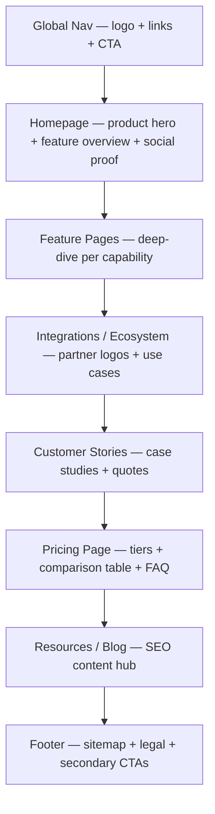

# SaaS Marketing Site

Multi-page marketing presence for B2B or B2C software — a consistent design system across homepage, feature pages, pricing, blog, and docs entry points.

## Anatomy

## Sections

### 1. Global Navigation
- **Purpose:** Orient visitors instantly, surface the primary conversion action on every page, and create a consistent shell across the entire site.
- **Pattern:** Fixed or sticky top bar. Logo left. Primary nav links center or left. CTA button(s) right — typically "Log in" (ghost/text) + "Start free" (filled). Max 5 nav items before overflow or mega-menu is required.
- **Content:** Product name/logo, 3–5 top-level links (Product, Pricing, Customers, Resources, Docs), "Log in" link, primary CTA button. Optional: announcement bar above nav for time-sensitive offers.
- **Common mistakes:** Too many nav links — every item competes with the CTA. No persistent CTA — visitors get lost on inner pages and can't find where to sign up. Active state absent — user loses sense of location. Mobile nav that's difficult to open or navigate.

### 2. Homepage Hero
- **Purpose:** Establish the product category, signal quality, and route visitors to the section most relevant to them.
- **Pattern:** Full or near-full viewport. Bold headline + subhead + CTA left-aligned (or centered for consumer). Product screenshot, video, or animated UI right or below. Optional: brief trust line ("Used by 10,000+ teams at Stripe, Figma, Notion").
- **Content:** Category-defining headline. One product screenshot or demo video thumbnail. Primary CTA ("Start for free") + secondary link ("See a demo" or "Watch video"). Optional eyebrow label positioning the category.
- **Common mistakes:** Homepage that reads like a landing page — SaaS marketing sites must route diverse intent (signups, enterprise leads, job seekers, press). Hiding the product — abstract art instead of UI screenshot loses conversion. Duplicate of the landing page — homepage needs richer navigation and multiple paths.

### 3. Feature Overview (Homepage)
- **Purpose:** Show breadth without overwhelming — give visitors a map of capabilities to navigate to.
- **Pattern:** Section of 3–6 feature blocks, each linking to a deeper feature page. Icon or small illustration, title, 1–2 sentence description, optional "Learn more →" link.
- **Content:** Top-level capability names. Frame each as a benefit ("See everything in one place" not "Unified Dashboard"). Link to dedicated feature detail pages.
- **Common mistakes:** Feature names that require domain knowledge. No links — visitors can't go deeper. Treating this as the final word on each feature rather than a navigation hub.

### 4. Feature Detail Pages
- **Purpose:** Convert visitors with specific needs — these are often the highest-intent entry points from SEO and paid campaigns.
- **Pattern:** Page-level hero with feature-specific headline and screenshot. Multiple scroll sections showing UI, use cases, and user outcomes. Embedded customer quote relevant to this feature. Links to related features and integrations. CTA at bottom.
- **Content:** Feature-specific headline, 2–4 sub-features with screenshots/animations, relevant testimonial, related integration logos, closing CTA.
- **Common mistakes:** Feature pages that copy-paste homepage content. Missing real UI screenshots — animation-only pages feel evasive. No internal links — feature pages should be a web, not dead ends.

### 5. Integrations / Ecosystem
- **Purpose:** Reduce switching cost objections — show the product fits into the user's existing stack.
- **Pattern:** Full-width section or dedicated page. Search-filterable logo grid of integration partners. Callout for most popular integrations with brief descriptions. "Build your own" link if API/webhook exists.
- **Content:** Integration logos (sorted by category or popularity), brief description of what each integration does, CTA to integration-specific docs.
- **Common mistakes:** Logos with no context — users need to know what the integration does, not just that it exists. Outdated integrations — broken logos or deprecated partnerships damage trust. No filter or search — a wall of 200 logos is unusable.

### 6. Customer Stories
- **Purpose:** Social proof at depth — move enterprise buyers from interest to conviction.
- **Pattern:** Hub page with filterable case study cards (by industry, company size, use case). Individual case study pages: challenge → solution → measurable outcome. Pull quote with photo and name prominently featured.
- **Content:** 3–6 featured customers on hub, ideally across different industries/sizes. Each case study: company background, specific problem, how the product solved it, quantified result ("Reduced deployment time by 60%").
- **Common mistakes:** Vague outcomes ("improved efficiency") — specificity creates believability. Missing the "before" state — contrast makes the solution compelling. All customers from the same industry — signals limited applicability.

### 7. Pricing Page
- **Purpose:** Dedicated, SEO-indexed page that handles the "how much?" question with full transparency.
- **Pattern:** Monthly/annual toggle at top. 3–4 tier cards with feature lists. Full comparison table below the cards. FAQ section. Enterprise contact CTA. Optional: ROI calculator or savings calculator.
- **Content:** Tier names, prices, key differentiating features per tier, CTA per tier, "Most popular" signal, full feature comparison table, 5–8 FAQ entries addressing pricing objections.
- **Common mistakes:** Pricing page with no answer to "What happens if I exceed my plan?" Missing "Free forever" vs "Free trial" distinction — users assume the wrong thing. Comparison table that's 80+ rows — compress to the 20 features that actually drive decisions.

### 8. Resources / Blog
- **Purpose:** SEO-driven content hub that attracts organic traffic and nurtures prospects who aren't ready to buy.
- **Pattern:** Hub page with filterable article cards (category, topic, type). Individual article pages with clean reading experience: table of contents, inline CTAs, related posts sidebar or bottom section.
- **Content:** Blog posts, guides, tutorials, changelog, customer spotlights. Categories should map to buyer journey stages (awareness, consideration, decision).
- **Common mistakes:** Blog that looks completely different from the marketing site — breaks brand coherence. No inline CTAs — long-form content should earn a conversion, not just a read. Missing table of contents on long articles — forces readers to scroll blindly.

### 9. Footer
- **Purpose:** Navigation safety net for visitors who scroll past everything. Legal compliance. Secondary conversion paths.
- **Pattern:** Multi-column link grid. Logo + tagline left or top. Product, Company, Resources, Legal columns. Bottom bar with copyright and secondary legal links. Optional: email newsletter signup.
- **Content:** Site map links, social icons, copyright, privacy policy / terms of service / cookie policy links. Optional: product status link, SOC 2 badge for B2B trust.
- **Common mistakes:** Footer that duplicates the nav exactly — add depth, not repetition. Missing legal links — legal requirements, not decoration. No newsletter or secondary CTA — footer visitors are often highly engaged.

## Style Pairings

| Style | Fit | Notes |
|-------|-----|-------|
| Minimalist Swiss | Strong | Industry default for dev tools, productivity, data. Grid system scales beautifully across a multi-page site. |
| Corporate Clean | Strong | B2B enterprise SaaS. Signals maturity, reliability. Works well with blue-gray palettes. |
| Dark Luxury | Strong | Premium or specialized SaaS (security, fintech, AI). Dark backgrounds create visual cohesion across pages. |
| American Industrial | Moderate | Infrastructure, AI, and engineering-focused products. Bold and precise, but can feel heavy on content-rich pages. |
| Editorial Magazine | Moderate | Design tools, creative SaaS, media platforms. Requires editorial discipline to maintain across many page types. |
| Brutalist Raw | Weak | Too much cognitive load across a multi-page site. Better reserved for single-page marketing moments. |
| Retro Analog | Weak | Rarely appropriate for SaaS — warmth conflicts with software product expectations. |

## Typography Recipe

| Element | Spec |
|---------|------|
| Nav links | 14–15px, medium (500), neutral gray |
| Nav CTA | 14–15px, semibold (600), contrasting color |
| Homepage hero headline | 56–80px, bold (700–800), −0.03em tracking |
| Feature page hero headline | 40–56px, bold (700), −0.02em tracking |
| Section headline | 32–42px, semibold (600–700) |
| Feature card title | 18–20px, semibold (600) |
| Body / descriptions | 16–18px, regular (400), 1.6–1.75 line-height |
| Blog article body | 17–19px, regular (400), 1.75–1.85 line-height, 65ch max-width |
| Table cell text | 14–15px, regular (400) |
| Footer links | 14px, regular (400), muted color |
| Eyebrow / label | 12–13px, medium (500), all-caps or tracked-out |

Font suggestions: Inter, Geist, Plus Jakarta Sans, DM Sans, Neue Haas Grotesk

## Color Strategy

- **Primary action:** Brand color saturated for all primary CTAs — rigorously consistent across every page so the button is always instantly recognizable
- **Background:** Consistent off-white or white base across pages. Section alternation should be subtle (2–4% gray shift) — wild background color changes between pages fracture coherence
- **Hierarchy signals:** One accent color, strictly controlled. Avoid letting feature-page heroes drift into different color palettes per feature — the system must feel unified
- **Pricing:** Use the brand accent to highlight the recommended tier. Green for "included" checkmarks, red/gray for "not included" — universal visual convention, don't reinvent it
- **Blog / Resources:** Reduce visual weight — these pages are reading experiences. More white, smaller type accents, CTA inline banners at moderate contrast

## Spacing & Rhythm

- Section padding: `6rem`–`10rem` top/bottom on desktop; `3.5rem`–`5rem` on mobile
- Content max-width: `1200px`–`1400px` for full-width; `800px` for text columns; `1100px` for feature sections
- Nav height: `60px`–`72px`
- Footer columns: 4–5 columns desktop, 2-column mobile
- Vertical rhythm: 8px base unit throughout. Components, grid gaps, padding — all multiples of 8
- Blog article: `720px`–`760px` measure for body text, `200px`–`260px` sidebar if used

## OSS Stack

| Need | Recommended | Alt |
|------|-------------|-----|
| Framework | Next.js (App Router) | Astro (content-heavy), Remix |
| Styling | Tailwind CSS | CSS Modules, Stitches |
| Components | shadcn/ui | Radix UI |
| Animation | Framer Motion | GSAP ScrollTrigger |
| Icons | Lucide | Phosphor |
| MDX / Blog | Contentlayer + MDX | Sanity, Contentful |
| Search | Algolia DocSearch | Pagefind (static) |
| Analytics | PostHog | Plausible, Mixpanel |
| A/B Testing | Statsig | LaunchDarkly |
| Forms | React Hook Form | Typeform embed |

## Responsive Breakpoints

| Breakpoint | Layout change |
|------------|--------------|
| < 640px | Nav collapses to hamburger. All sections single-column. Feature cards stack. Pricing cards stack vertically. Footer 1-column. |
| 640–1024px | 2-column feature grids. Side-by-side hero with text above image. Pricing 2-up if only 2 tiers. Footer 2-column. |
| > 1024px | Full desktop: sticky nav. Side-by-side hero. 3–4 column feature grids. Full pricing table visible. 4-column footer. |

## Checklist

- [ ] Navigation present and consistent on every page
- [ ] Primary CTA button appears in nav and persists on scroll (sticky nav)
- [ ] Homepage routes multiple visitor intents (signup, demo, enterprise, docs)
- [ ] Each feature has a dedicated page (not just a section on the homepage)
- [ ] Integration page exists and is filterable
- [ ] At least 3 customer case studies with quantified results
- [ ] Pricing page is a standalone, indexable page at `/pricing`
- [ ] Comparison table covers the decisions that actually drive plan choice
- [ ] Blog/resources section is indexed and filterable
- [ ] Footer contains full site map + all legal links
- [ ] Open Graph images set per page (not just homepage)
- [ ] Canonical URLs set correctly on all pages
- [ ] Page transitions are consistent and non-jarring
- [ ] Design system documented (colors, type, spacing, components) before building page 3+
- [ ] Mobile tested at 375px and 768px across all page types

## Examples

- [stripe.com](https://stripe.com) — The gold standard for SaaS marketing sites. Study the feature page system, the integration ecosystem page, and the pricing table structure.
- [notion.so](https://notion.so) — Observe how they handle persona routing on the homepage without overwhelming. Team vs. personal vs. enterprise paths.
- [figma.com](https://figma.com) — Feature page depth model. Each capability gets a dedicated visual narrative.
- [linear.app](https://linear.app) — Minimal navigation with maximum clarity. Study the feature section flow and the how-it-works section.
- [vercel.com](https://vercel.com) — Dark mode SaaS marketing site done right. Consistent dark system across all pages without feeling like every page was designed separately.
- [supabase.com](https://supabase.com) — Open source SaaS with strong ecosystem page and docs integration. Study the integration grid and the community section.
