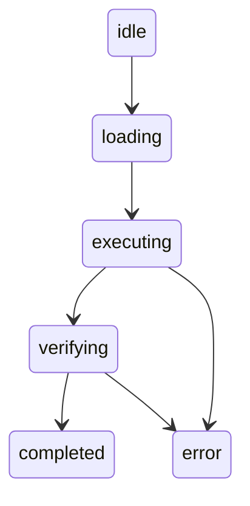

# Thread Schema

Threads persist complete session state including conversation summary, git context, and skill execution info.

## Location

`workspace/threads/{thread_id}.json`

## Thread ID Format

`T-{YYYYMMDD}-{HHMMSS}-{slug}`

Example: `T-20260123-143052-auth-feature`

## Schema (Full Checkpoint)

```json
{
  "thread_id": "T-20260123-143052-auth-feature",
  "version": 1,
  "type": "checkpoint",
  "created_at": "2026-01-23T14:30:52.000Z",
  "updated_at": "2026-01-23T14:35:00.000Z",

  "workspace_root": "~/repos/my-project",
  "cwd": "repos/my-project",

  "git": {
    "branch": "feature/user-auth",
    "remote_url": "git@github.com:user/repo.git",
    "initial_commit": "abc1234",
    "current_commit": "def5678",
    "commits_made": [
      "def5678: feat: add JWT authentication"
    ],
    "dirty": false
  },

  "skill": {
    "id": "backend",
    "state": "completed",
    "started_at": "2026-01-23T14:30:52.000Z",
    "completed_at": "2026-01-23T14:35:00.000Z"
  },

  "conversation_summary": "Implemented JWT authentication with login and refresh token endpoints",
  "files_touched": [
    "src/auth/jwt.ts",
    "src/routes/auth.ts"
  ],
  "next_steps": [],

  "metadata": {
    "title": "Auth Feature - Backend Skill",
    "tags": ["auth", "backend", "jwt"]
  }
}
```

## Schema (Auto-Checkpoint — Lightweight)

Auto-checkpoints are created automatically by PostToolUse hooks after git commits, file generation, and skill completions. They use a lighter format — no INDEX rebuilds, no `recent.md` updates.

```json
{
  "thread_id": "T-20260123-143052-auto-auth-commit",
  "version": 1,
  "type": "auto-checkpoint",
  "created_at": "2026-01-23T14:30:52.000Z",
  "updated_at": "2026-01-23T14:30:52.000Z",

  "workspace_root": "~/repos/my-project",
  "cwd": "repos/my-project",

  "git": {
    "branch": "feature/user-auth",
    "current_commit": "def5678",
    "dirty": false
  },

  "conversation_summary": "Committed JWT authentication implementation",
  "files_touched": ["src/auth/jwt.ts"],

  "metadata": {
    "title": "Auto: auth commit",
    "tags": ["auto-checkpoint"],
    "trigger": "git-commit"
  }
}
```

**Differences from full checkpoint:** No `initial_commit`, `commits_made`, `remote_url`, `skill`, or `next_steps` fields. Thread ID contains `-auto-` after timestamp. Auto-checkpoints are purged after 14 days by `/cleanup`.

## Fields

### Core

| Field | Type | Description |
|-------|------|-------------|
| `thread_id` | string | Unique identifier |
| `version` | number | Schema version (currently 1) |
| `type` | enum | `"checkpoint"` (manual), `"auto-checkpoint"` (hook-triggered), `"handoff"` |
| `created_at` | ISO8601 | Thread creation time |
| `updated_at` | ISO8601 | Last update time |

### Context

| Field | Type | Description |
|-------|------|-------------|
| `workspace_root` | string | Project root path |
| `cwd` | string | Working directory |

### Git State

| Field | Type | Description |
|-------|------|-------------|
| `git.branch` | string | Current branch |
| `git.remote_url` | string | Origin remote URL |
| `git.initial_commit` | string | Commit SHA at thread start |
| `git.current_commit` | string | Commit SHA at thread end |
| `git.commits_made` | string[] | Commits created during session |
| `git.dirty` | boolean | Uncommitted changes present |

### Skill State

| Field | Type | Description |
|-------|------|-------------|
| `skill.id` | string | Skill ID (e.g., `backend`, `architect`) |
| `skill.state` | enum | `idle`, `loading`, `executing`, `verifying`, `completed`, `error` |
| `skill.started_at` | ISO8601 | Execution start |
| `skill.completed_at` | ISO8601 | Execution end |

### Results

| Field | Type | Description |
|-------|------|-------------|
| `conversation_summary` | string | What was accomplished |
| `files_touched` | string[] | Files created/modified |
| `next_steps` | string[] | Remaining work |

### Metadata

| Field | Type | Description |
|-------|------|-------------|
| `metadata.title` | string | Human-readable title |
| `metadata.tags` | string[] | Searchable tags |

## State Values

Skill states follow the FSM:



## Usage

### Creating a Thread

```bash
# Captured by /checkpoint command
/checkpoint auth-feature
```

### Searching Threads

```bash
# Via /search command
/search auth
```

### Listing Recent

```bash
ls -lt workspace/threads/ | head -10
```

## Backward Compatibility

Old checkpoints in `workspace/checkpoints/` remain valid. Threads are a superset with richer git context.

## See Also

- `/checkpoint` command — Creates threads
- `/search` command — Searches threads
- [Skill Schema](skill-schema.md) — Skill state machine details
